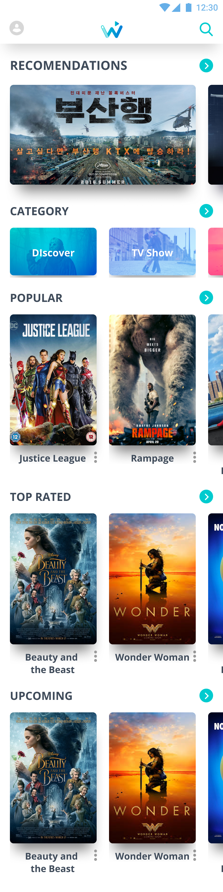

# Movie with Clean Architect

## Overview
- This is a sample application that utilizes the Clean Architecture framework and the Movie Database API (https://www.themoviedb.org/documentation/api) to retrieve and display movie information.
- The application is built using Hilt for dependency injection and Coroutines for asynchronous programming.

## User Interface
The user interface consists of two main screens: the Home screen and the Movie Detail screen.

### Home screen

### Movie detail screen

## Building the Application
- Clone the project from the following repository: [https://github.com/hungan1409/TheMovieDirectory.git](https://github.com/hungan1409/TheMovieDirectory.git)
- Use Android Framework version 3.5.x or greater for compilation and execution.

## Architecture
This example follows the principles of Clean Architecture for developing the project. For more information on Clean Architecture, refer to the following link: [The Clean Architecture](https://blog.cleancoder.com/uncle-bob/2012/08/13/the-clean-architecture.html)

### Data Flow

### Work Flow

## Libraries Used
- **Foundation**: Provides components for core system capabilities, Kotlin extensions, multidex support, and automated testing.
  - **AppCompat**: Ensures graceful degradation on older Android versions.
  - **Android KTX**: Enables writing more concise and idiomatic Kotlin code.
  - **Test**: Offers an Android testing framework for unit and runtime UI tests.
- **Architecture**: Offers a collection of libraries for designing robust, testable, and maintainable apps. It includes classes for managing UI component lifecycle and handling data persistence.
  - **Data Binding**: Allows declarative binding of observable data to UI elements.
  - **Lifecycles**: Facilitates creating a UI that automatically responds to lifecycle events.
  - **LiveData**: Enables building data objects that notify views when the underlying database changes.
  - **Navigation**: Handles all aspects of in-app navigation.
  - **Room**: Provides access to the app's SQLite database with in-app objects and compile-time checks.
  - **ViewModel**: Stores UI-related data that persists during app rotations. It also simplifies scheduling asynchronous tasks for optimal execution.
  - **WorkManager**: Manages background jobs in Android.
- **UI**: Provides details on using UI components in apps, either together or separately.
  - **Animations & Transitions**: Allows moving widgets and transitioning between screens.
  - **Fragment**: Represents a basic unit of composable UI.
  - **Layout**: Facilitates widget arrangement using different algorithms.
- **Third-party libraries**
  - **Glide**: Used for image loading.
  - **Kotlin Coroutines**: Manages background threads with simplified code and reduces the need for callbacks.
  - **Hilt**: Enables dependency injection.
  - **Retrofit**: Provides a type-safe HTTP client for Android.
  - **EasyPermission**: A wrapper library that simplifies basic system permission logic when targeting Android M or higher.
  - **CircleImageView**: A fast circular ImageView, perfect for profile images.

[0]: https://developer.android.com/jetpack/components
[1]: https://developer.android.com/topic/libraries/support-library/packages#v7-appcompat
[2]: https://developer.android.com/kotlin/ktx
[4]: https://developer.android.com/training/testing/
[10]: https://developer.android.com/jetpack/arch/
[11]: https://developer.android.com/topic/libraries/data-binding/
[12]: https://developer.android.com/topic/libraries/architecture/lifecycle
[13]: https://developer.android.com/topic/libraries/architecture/livedata
[14]: https://developer.android.com/topic/libraries/architecture/navigation/
[16]: https://developer.android.com/topic/libraries/architecture/room
[17]: https://developer.android.com/topic/libraries/architecture/viewmodel
[18]: https://developer.android.com/topic/libraries/architecture/workmanager
[30]: https://developer.android.com/guide/topics/ui
[31]: https://developer.android.com/training/animation/
[34]: https://developer.android.com/guide/components/fragments
[35]: https://developer.android.com/guide/topics/ui/declaring-layout
[90]: https://bumptech.github.io/glide/
[91]: https://github.com/Kotlin/kotlinx.coroutines
[93]: https://dagger.dev/hilt/
[94]: https://github.com/square/retrofit
[95]: https://github.com/googlesamples/easypermissions
[96]: https://github.com/hdodenhof/CircleImageView
